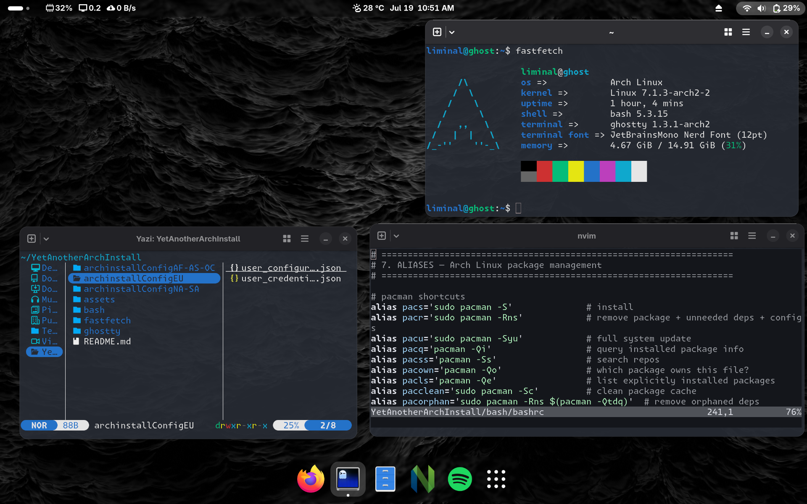

# YetAnotherArchInstall

**The ultimate, hassle-free installation guide for your favorite rolling release distro.**

## Overview

Arch Linux has a historic reputation for being a complex, text-heavy mountain to climb. **YetAnotherArchInstall** removes that barrier by relying on pre-configured setup files that eliminate manual partitioning, package selection, and configuration errors.

By leveraging pre-baked configuration files, the tedious heavy lifting is automated for you — so you can get a powerful, optimized, and bleeding-edge system running with minimal effort.

## Why Use This

Setting up Arch Linux from scratch usually means manually partitioning drives, navigating installer menus, and then spending hours installing your everyday tools afterward. This repo eliminates most of that friction:

- **Pre-configured `archinstall` files** — configurations plug directly into the archinstall script, so you don't have to click through and set each menu option manually. Review the settings, and go.
- **Popular software included out of the box** — over 100 of the most-used Linux tools and everyday utilities are already part of the setup, so you skip the post-install routine of hunting them down one by one.
- **Faster, more consistent installs** — whether setting up a new machine or reinstalling, you get a predictable result without repeating the same manual steps every time.

In short: instead of treating every install as a fresh, from-scratch process, use this repo as a starting template and get to a usable system much faster.

*[Catppuccin](https://github.com/catppuccin) themed [Ghostty](https://github.com/ghostty-org/ghostty) terminal*

## Features

- **Region-specific configuration files** — pre-configured setups are available for various regions, so keyboard layouts, locales, mirrors, and timezones are already sorted for your area instead of something you have to configure by hand.

- **Extra configs for individual applications** — beyond the base install, additional configuration files are included for applications like the Ghostty terminal, letting you drop in a polished setup rather than tweaking things yourself from a default config.

  <!-- Suggested placement: screenshot of a configured application (e.g. Ghostty config, or a themed app) -->
  

  

  

- **A more refined experience out of the box** — these extras go beyond just getting Arch installed; they help the system feel set up and ready to use from the first login.

  <!-- Suggested placement: full desktop screenshot showing the final polished result -->
  

  

  

## Getting Started

Check out the **[repository wiki](https://github.com/Z00Li/YetAnotherArchInstall/wiki)** for a full walkthrough on what to do next once your install is complete.