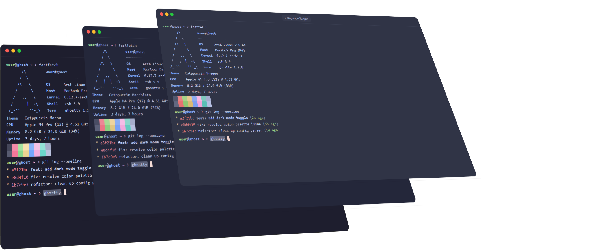

Welcome to the **ultimate, hassle-free** installation guide for your favorite rolling release distro. Arch has a historic reputation for being a complex, text-heavy mountain to climb. However, this guide relies on pre-configured setup files to eliminate manual partitioning, package selecting, and configuration errors. By leveraging pre-baked configuration files, we automate the tedious heavy lifting so you can get a powerful, optimized, and bleeding-edge system running with absolute minimal effort.

## Why use this as a guideline
Setting up Arch Linux from scratch usually means spending time manually partitioning or navigating around menus and installing your everyday tools afterward. This repo eliminates most of that friction:

- **Pre-configured** `archinstall` **files** — the configuration plugs directly into the archinstall script, so you don't have to click through and configure each menu option manually. Maybe review the settings and go.
- **Popular software included out of the box** — over 100 of the most used linux tools and other everyday utilities are already part of the setup, so you skip the post-install routine of hunting down and installing them one by one.
- **Faster, more consistent installs** — whether you're setting up a new machine or reinstalling, you get a predictable result without repeating the same manual steps every time.

In short: instead of treating every install as a fresh, from-scratch configuration process, you can use this repo as a starting template and get to a usable system much faster.

*[Catppuccin](https://github.com/catppuccin) themed [Ghostty](https://github.com/ghostty-org/ghostty) terminal*
## Features

- **Region-specific configuration files** — pre-configured setups are available for various regions, so keyboard layouts, locales, mirrors, and timezones are already sorted for your area instead of something you have to configure by hand.
- **Extra configs for individual applications** — beyond the base install, additional configuration files are included for applications like the Ghostty terminal, letting you drop in a polished setup rather than tweaking things yourself from a default config.
- **A more refined experience out of the box** — these extras go beyond just getting Arch installed; they help the system feel set up and ready to use from the first login.

## First Steps

Check out the [repository wiki](https://github.com/Z00Li/YetAnotherArchInstall/wiki) for a walkthrough on what to do next once your install is complete.
